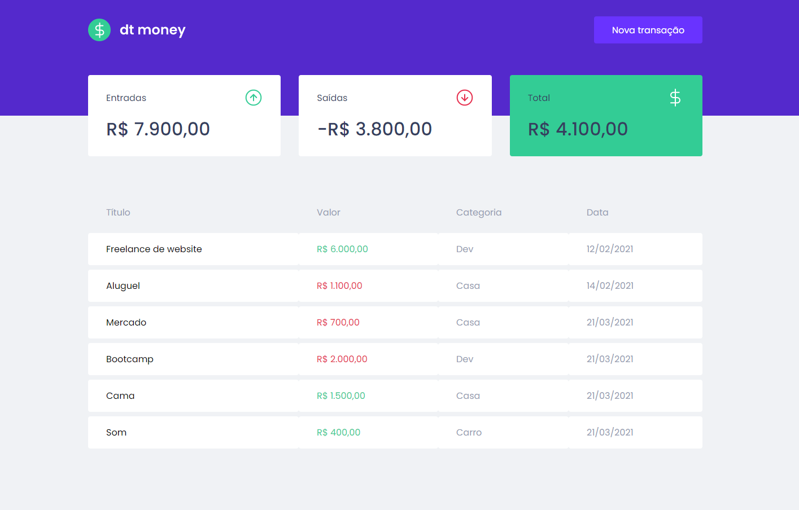
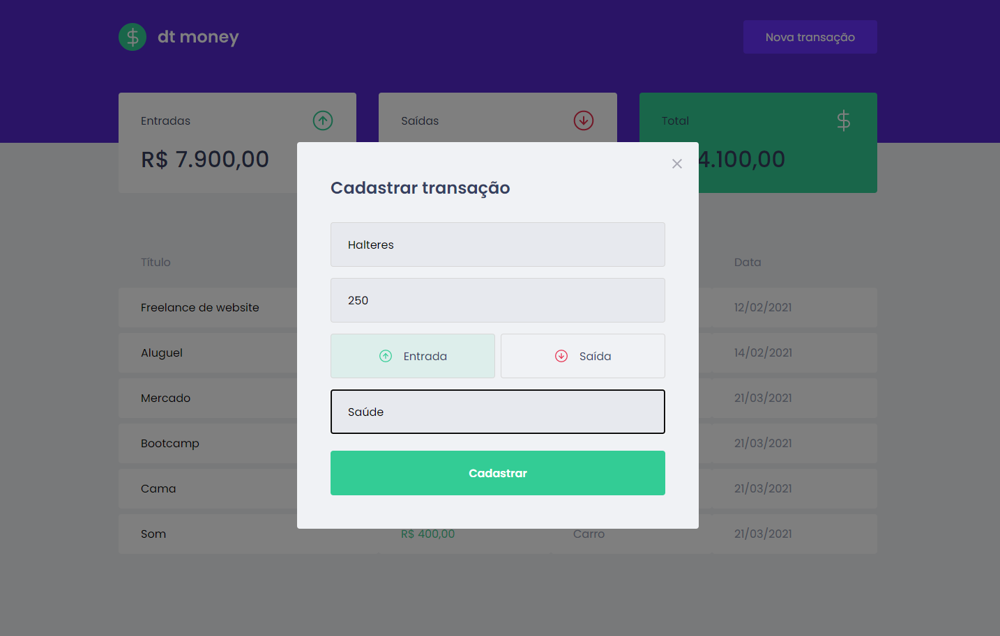

<h3 align="center">
   Finance App.
</h3>

   
    <a href="https://www.linkedin.com/in/sergiorosa1/"> Sergio Rosa 
  

# 📌 Contents
> It's a financial control app based on the same idea as devfinances, but with more advanced technologies, open source libraries, and resources. Transactions can be registered, deleted, and incoming and outgoing transactions can be seen

# Technologies
This project is being developed with the following technologies:

- ReactJS
- TypeScript
- useState
- useEfect
- Context API
- Styled Components
- Mirage JS
- axios
- React Modal
- polished

# :camera: Screenshots

   
   

This project by [Sergio Rosa](https://www.linkedin.com/in/sergiorosa1/). 

Thank you! 

